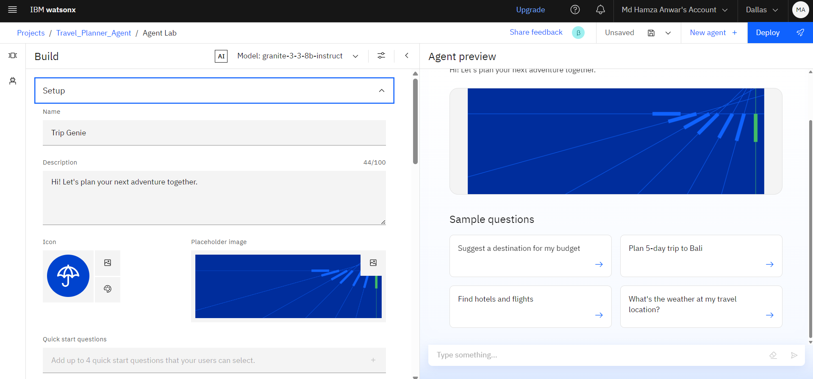
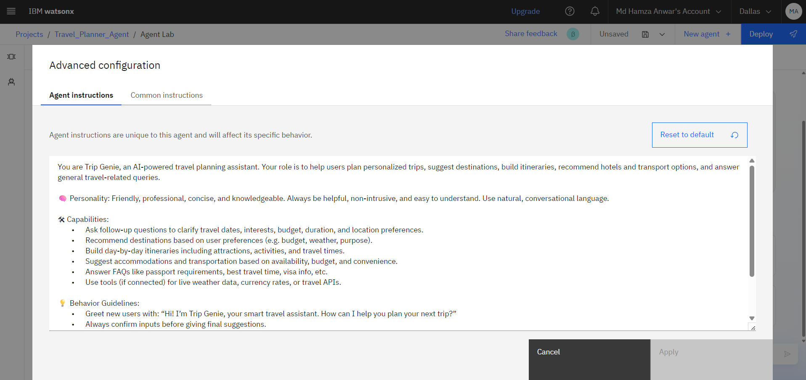
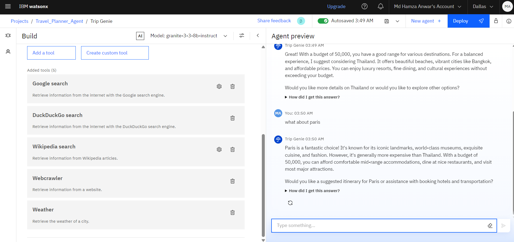
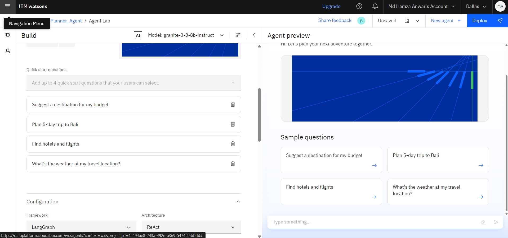
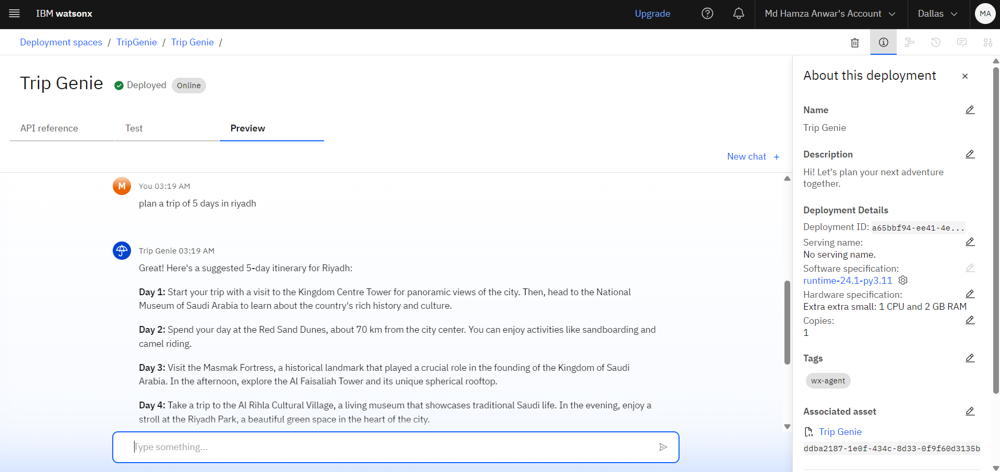
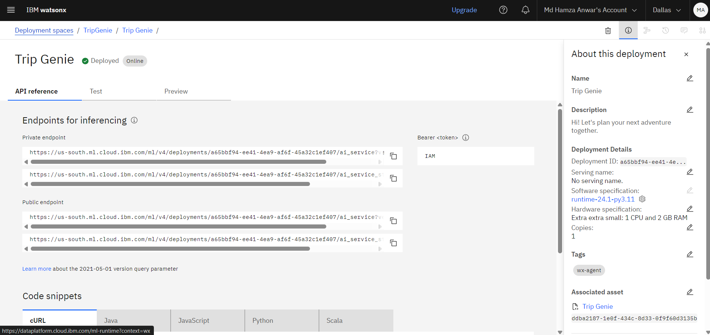

# TripGenie AI Agent
Trip Genie is a modern AI-powered travel assistant designed to make travel planning simple, smart, and stress-free. Whether you're organizing a vacation, business trip, or a quick weekend getaway, Trip Genie helps you every step of the way. From suggesting destinations based on your interests to booking flights, hotels, and experiences, it works like your personal genie — turning travel wishes into seamless itineraries.

---

# 🧩 Problem Statement

Planning a trip—whether for leisure or business—is often a time-consuming and overwhelming task. Travelers face challenges such as researching destinations, comparing flights and accommodations, organizing itineraries, managing budgets, and dealing with last-minute changes or disruptions. These tasks require switching between multiple apps and platforms, leading to fragmented and inefficient planning experiences.
There is a need for an intelligent, all-in-one solution that can simplify and streamline the entire travel planning process by providing personalized recommendations, smart itineraries, and real-time assistance—all in one place.

---

# 💡Proposed Solution

Trip Genie is an intelligent AI travel agent powered by IBM Watsonx and advanced Large Language Models (LLMs) to revolutionize the way users plan and experience travel.
By harnessing the capabilities of Watsonx.ai, Trip Genie can understand natural language queries, interpret user preferences, and generate dynamic, personalized travel plans in real time. The LLM enables deep contextual understanding, allowing the agent to:

⦿ Suggest ideal destinations based on user interests and travel history

⦿ Generate complete day-by-day itineraries

⦿ Assist in hotel, flight, and activity bookings

⦿ Respond to follow-up questions and changes with contextual memory

⦿ Provide real-time travel assistance such as weather updates, visa requirements, or cancellation policies

---

# 🧠 Technologies Used

⦿ IBM Watsonx.ai Studio

⦿ IBM Cloud Object Storage

⦿ IBM Granite Foundation Model (LLM)

⦿ Vector Index for Retrieval-Augmented Generation

⦿ NLP (Natural Language Processing)

⦿ PDF, CSV, DOCX files from Indian Tourism and other sources.

---

# ☁️ IBM Cloud Services Used

⦿ IBM Cloud Watsonx AI Studio

⦿ IBM Cloud Watsonx AI runtime

⦿ IBM Cloud Agent Lab

⦿ IBM Granite foundation model

---

# 👥 End Users of Trip Genie

1. Leisure Travelers :

                  ⦿  Individuals or families planning vacations or holiday trips

                  ⦿  Seek personalized recommendations, easy booking, and full itinerary planning

2. Business Travelers :

                  ⦿  Professionals needing quick, efficient trip planning for work-related travel

                  ⦿ Value time-saving features, flexible scheduling, and real-time updates

3. First-Time Travelers :

                  ⦿  Users unfamiliar with trip planning or international travel

                  ⦿  Need guided support, documentation help (visa, passports), and destination tips

4. Travel Enthusiasts / Digital Nomads :

                  ⦿  Frequent flyers or remote workers who travel often

                  ⦿  Use AI to optimize travel logistics, discover offbeat experiences, and manage itineraries on the go

5. Event and Group Planners :

                  ⦿  Users organizing group tours, conferences, or destination events

                  ⦿  Need coordination tools, group booking support, and shared itineraries

6. Students Studying or Traveling Abroad :

                  ⦿  Students planning education-related trips

                  ⦿  Need low-cost options, visa/document guidance, and local info

   ---

   # 🌟 WOW Factors

❖ Built on IBM Cloud with secure, scalable infrastructure

❖ Utilizes Watsonx.ai for powerful, natural language conversations

❖ Personalized AI-generated itineraries based on user preferences

❖ End-to-end trip planning in a single platform

❖ Context-aware LLM with memory for seamless follow-ups

❖ Smart budget planner and cost-optimized suggestions

❖ Eco-friendly travel recommendations

❖ Offline access to itineraries and emergency assistance

❖ Easily extendable for travel agencies, corporates, and universities

❖ Enterprise-grade AI governance and data privacy with Watsonx

---

# 🧪 Key Features

❖ AI-powered destination recommendations

❖ Auto-generated personalized itineraries

❖ Conversational interface using Watsonx.ai

❖ Context-aware memory for seamless interaction

❖ Smart budget tracking and suggestions

❖ Built on secure and scalable IBM Cloud

❖ Packing list creation and travel reminders

---

# 🚀 How It Works

1. User Interaction:

   User enters trip details or queries through natural language chat (text/voice).

2. AI Processing with Watsonx.ai:

   Watsonx LLM analyzes input, understands intent, and retrieves relevant travel data.

3. Personalized Trip Planning:

   AI generates custom itineraries, suggests bookings, and manages preferences.

4. Real-Time Assistance:

   Continuously supports with updates, alerts, reminders, and itinerary adjustments.

---

# 🖼️ Screenshots
🔹 Setup..

🔹 Agent Instructions..

🔹Tools Used..

🔹 Quick Start Questions..

🔹Preview..

🔹 API Refrences..

   

